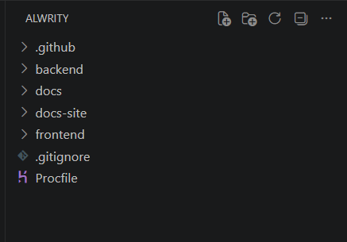

# Quick Start Guide

Welcome to ALwrity!

This guide will help you set up ALwrity on your local machine for development. Whether you are a first-time contributor, a developer exploring the project, or someone who wants to run ALwrity locally, this guide provides a step-by-step setup process.

By the end of this guide, you will be able to:

- Clone the ALwrity repository.
- Install the required backend and frontend dependencies (software packages).
- Configure the required environment variables.
- Run ALwrity successfully on your local machine.
- Verify that the application is working correctly.

## Prerequisites

Before setting up ALwrity, ensure the following requirements are met:

- **Python 3.10 or later** – Required to run the backend services.
- **Node.js 18 or later** – Required to build and run the frontend application.
- **Git** – Required to clone the ALwrity repository.
- **AI Service API Keys** – Required to enable AI-powered content generation features.

Verify that Python, Node.js, and Git are installed by running:

```bash
python --version
node --version
git --version
```

If each command displays a version number, your system is ready for installation.

If any of these commands are not recognized, install the required software before continuing.

## Installation

Follow the steps below to install ALwrity on your local machine.

### 1. Clone the Repository

Open a terminal (Command Prompt, PowerShell, or Terminal) and run:

```bash
git clone https://github.com/AJaySi/ALwrity.git
cd ALwrity
```
After cloning the repository, your project directory should look similar to the following:



The repository is organized into the following main directories:

- **backend/** – Python backend services
- **frontend/** – React frontend application
- **docs-site/** – Documentation website built with MkDocs
- **docs/** – Internal project documentation
- **.github/** – GitHub workflows and project templates


If Git is not installed, download and install it from
**[Git Downloads](https://git-scm.com/downloads)** before continuing.

### 2. Install Backend Dependencies

Move to the backend directory:

```bash
cd backend
```

Install the required Python packages:

```bash
pip install -r requirements.txt
```

Wait until the installation completes successfully before proceeding to the next step. If any errors occur, resolve them before continuing.


### 3. Install Frontend Dependencies

Return to the project root:

```bash
cd ..
```

Move to the frontend directory:

```bash
cd frontend
```

Install the required Node.js packages:

```bash
npm install
```

This may take a few minutes depending on your internet connection.

After the installation completes successfully, continue to the configuration step.


## Configuration

Before running ALwrity, you need to configure the required environment variables for both the backend and frontend.


### 1. Backend Environment Variables

Navigate to the `backend` directory.

The backend provides an `env_template.txt` file that contains the required environment variables.

Copy this template and rename it to `.env`.

**Windows (Command Prompt)**

```cmd
copy env_template.txt .env
```

**Linux/macOS**

```bash
cp env_template.txt .env
```

After creating the `.env` file, open it in your preferred text editor and replace the placeholder values with your own configuration.

The `.env` file stores configuration values such as API keys, server settings, and database configuration that the backend requires to run.

Example:

```env
GEMINI_API_KEY=your_gemini_api_key
OPENAI_API_KEY=your_openai_api_key
ANTHROPIC_API_KEY=your_anthropic_api_key
```

The following table explains the most important environment variables used during local development.

### Environment Variable Descriptions

| Variable | Description | Where to Get It |
|----------|-------------|-----------------|
| `GEMINI_API_KEY` | API key used to access Google's Gemini models for AI-powered content generation. | Google AI Studio |
| `OPENAI_API_KEY` | API key used to access OpenAI models such as GPT. | OpenAI Platform |
| `ANTHROPIC_API_KEY` | API key used to access Anthropic Claude models. | Anthropic Console |
| `DATABASE_URL` | Database connection string used by the backend. Leave the default value for local development. | No action required |
| `SECRET_KEY` | Secret key used by the backend for secure sessions and authentication. Generate a random secure string before deployment. | Generate your own |
| `HOST` | Network interface on which the backend server runs. | Keep the default value (`0.0.0.0`) |
| `PORT` | Port used by the backend server. | Keep the default value (`8000`) |
| `DEBUG` | Enables debugging features during development. | Use `true` for development |
| `LOG_LEVEL` | Controls the amount of log information displayed by the backend. | Keep the default value (`INFO`) |

> **Important:** Replace the placeholder API keys and `SECRET_KEY` with your own values before starting the backend.

### 2. Frontend Environment Variables

The frontend includes an `env_template.txt` file containing the required environment variables.

Copy this template and rename it to `.env`.

**Windows (Command Prompt)**

```cmd
copy env_template.txt .env
```

**Linux/macOS**

```bash
cp env_template.txt .env
```

After creating the `.env` file, open it in your preferred text editor and update the required values.

Example:

```env
REACT_APP_API_BASE_URL=http://localhost:8000
REACT_APP_CLERK_PUBLISHABLE_KEY=your_clerk_publishable_key
REACT_APP_CLERK_JWT_TEMPLATE=
```

### Frontend Environment Variable Descriptions

| Variable | Description | Where to Get It |
|----------|-------------|-----------------|
| `REACT_APP_API_BASE_URL` | URL of the backend server that the frontend communicates with. | Use `http://localhost:8000` for local development. |
| `REACT_APP_CLERK_PUBLISHABLE_KEY` | Public key used by Clerk for frontend authentication. | Clerk Dashboard |
| `REACT_APP_CLERK_JWT_TEMPLATE` | Optional JWT template name used for authentication if configured in Clerk. Leave it blank unless your Clerk setup requires it. | Clerk Dashboard (optional) |

> **Important:** Replace `your_clerk_publishable_key` with your own Publishable Key before running the frontend.

You can create a free Clerk application and obtain your Publishable Key from the official Clerk documentation:

**[Clerk Documentation](https://clerk.com/docs)**

After saving the `.env` file, the frontend is ready to communicate with your local backend.

## Running the Application

After completing the installation and configuration steps, you can start the backend and frontend servers.

### 1. Start the Backend

Open a terminal and navigate to the backend directory.

```bash
cd backend
python start_alwrity_backend.py
```

If the backend starts successfully, you should see startup logs in the terminal.

To verify that the backend is running correctly, open the following URL in your web browser:

```text
http://localhost:8000
```

### 2. Start the Frontend

Open another terminal and navigate to the frontend directory.

```bash
cd frontend
npm start
```

Once the frontend starts successfully, open the following URL in your web browser:

```text
http://localhost:3000
```

If the setup was completed successfully, the ALwrity dashboard should load in your browser.

## Your First Content

### 1. Access the Dashboard

Once both the backend and frontend are running successfully, open your web browser and visit:

```text
http://localhost:3000
```

If this is your first time using ALwrity, complete the onboarding process by following the on-screen instructions.

After onboarding is complete, the ALwrity dashboard will open. From there, you can access ALwrity's AI-powered tools, including Blog Writer, LinkedIn Writer, SEO tools, and other content generation features.

### 2. Create Your First Blog Post

Follow these steps to generate your first AI-powered blog post:

1. From the dashboard, open **Blog Writer**.
2. Enter a blog topic or a keyword you want to write about.
3. Configure any available options, such as language, tone, or content preferences (if required).
4. Click **Generate Content**.
5. Wait for ALwrity to generate the blog draft.
6. Review the generated content and make any edits you want.
7. Use the **SEO Analysis** tools to improve the content before publishing or exporting it.


#### Blog Writer Example

The screenshot below shows the Blog Writer interface.


> **Tip:** If content generation fails, verify that your AI API keys are configured correctly in the backend `.env` file.


### 3. Create LinkedIn Content

ALwrity also helps you create professional LinkedIn content.

To get started:

1. Open **LinkedIn Writer** from the dashboard.
2. Choose the type of content you want to create (for example, a post, article, or carousel).
3. Enter your topic and specify your target audience.
4. Click **Generate** to create the initial content.
5. Review the generated content and make any edits before publishing.


#### LinkedIn Writer Example

The screenshot below shows the LinkedIn Writer interface.


> **Tip:** You can regenerate the content or modify the prompt if you want different writing styles or results.

## Next Steps

- **[Configuration Guide](configuration.md)** - Advanced configuration options
- **[First Steps](first-steps.md)** - Detailed walkthrough of key features
- **[API Reference](../api/overview.md)** - Integrate with your applications
- **[Best Practices](../guides/best-practices.md)** - Optimize your content strategy

## Troubleshooting

If you encounter any issues:

1. Check the [Troubleshooting Guide](../guides/troubleshooting.md)
2. Verify that your API keys have been added correctly to the backend `.env` file.
3. Ensure all dependencies are installed.
4. Check the console for error messages.

## Need Help?

If you encounter a bug, have a question, or would like to request a feature:

- Visit the [GitHub Issues](https://github.com/AJaySi/ALwrity/issues) page to report bugs, ask questions, or request features.

---

*Ready to start creating AI-powered content? Check out our [First Steps Guide](first-steps.md) for a detailed walkthrough!*